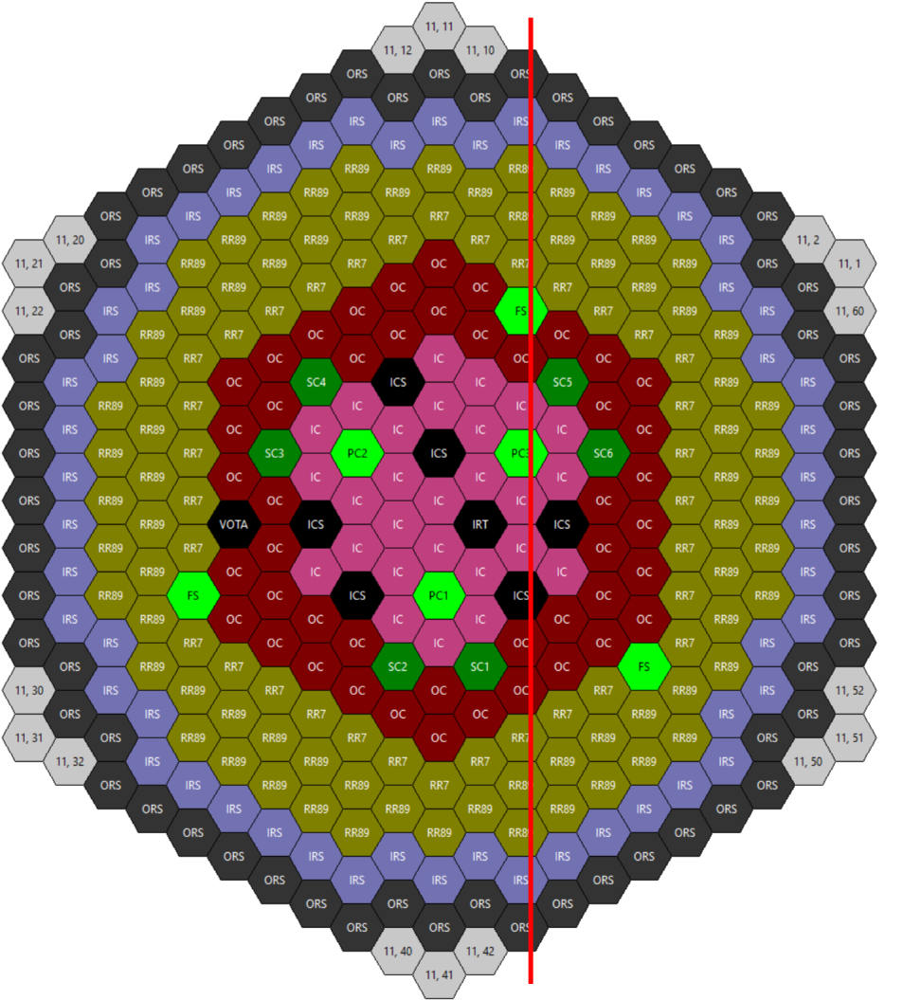
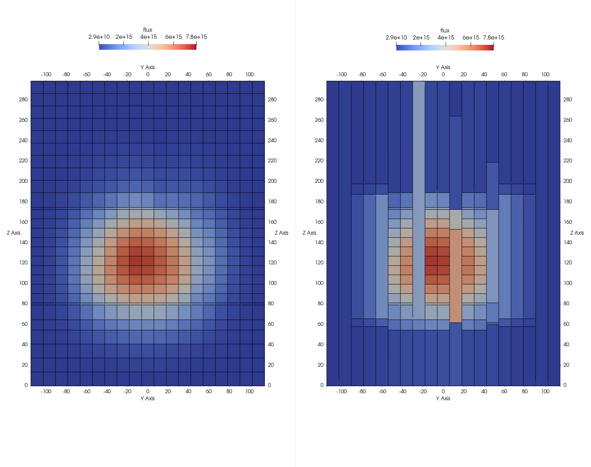
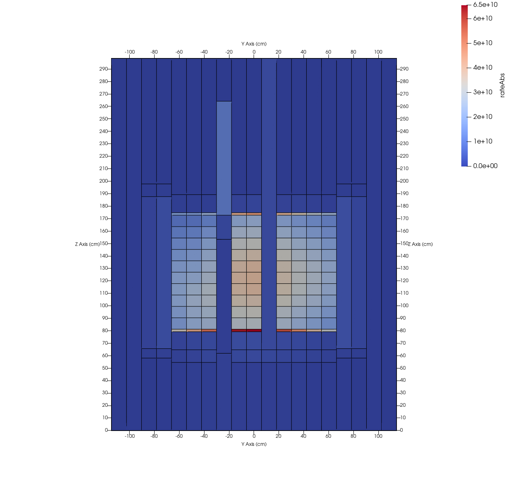
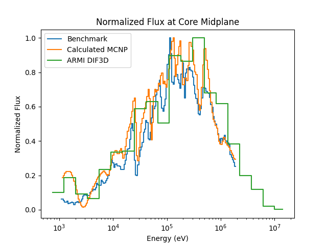
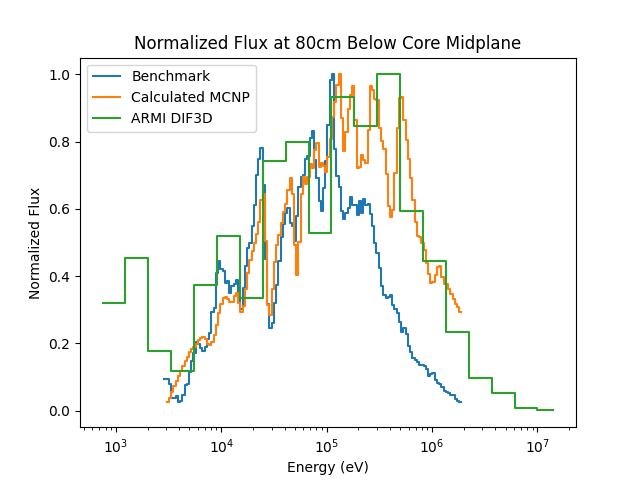

.. _sec-results:

Results
=======

The tests described in :doc:`testing` demonstrate the basic satisfaction of the design
requirements of the DIF3D-ARMI integration. To better showcase the full capabilities of
the DIF3D plugin, we also included a demonstration application (``dif3ddemo``)
that performs a realistic neutronics analysis of TerraPower's open-source `FFTF isothermal benchmark
model <https://github.com/terrapower/fftf-isothermal-model>`_. A detailed description of
this model can be found in the linked repository's README, and in the original benchmark
description [FFTF]_.

.. warning:: Due to the simple cross sections used, this section should not 
    be treated as a true benchmark evaluation of the FFTF, but it can certainly
    serve as the foundation for one.

Setup
^^^^^

The ``dif3ddemo`` application uses the open-source `Dragon plugin
<https://github.com/terrapower/dragon-armi-plugin>`_ to compute microscopic cross
sections. In order to enable the Dragon and DIF3D interfaces for this case, the
following settings were added to the settings file, ``FFTF.yaml``

.. code-block:: yaml

    dif3dExePath: path/to/dif3d
    writeDif3dDb: True
    dragonExePath: path/to/dragon
    dragonDataPath: path/to/draglibendfb8r0SHEM361
    neutronicsKernel: DIF3D-Nodal
    globalFluxActive: Neutron
    xsKernel: DRAGON

where ``path/to/X`` points to the location of ``X`` on the target system.  The case was
then run with::

    > dif3ddemo run FFYF.yaml

With the above additions to the settings, the ``dif3ddemo`` application performs the
following key operations:

 1. Initialize the ARMI reactor model based on the blueprints contained in
    ``FFTF-blueprints.yaml``.
 2. Compute microscopic cross sections for the two cross-section regions defined in the
    blueprints.
 3. Perform a DIF3D global flux solve.
 4. Apply the results of the DIF3D solution to the ARMI reactor model.
 5. Write the reactor state to a database file.

In the process of performing the DIF3D global flux solve, the
:py:class:`armi:armi.reactor.converters.uniformMesh.UniformMeshGeometryConverter` will
be used to impose a uniform axial mesh upon the ARMI reactor model. This is necessary,
because the as-input geometry features non-uniform axial meshes in its assembly designs,
and because DIF3D requires the axial mesh to be uniform across all assemblies. When the
DIF3D output is read, it is applied to this uniform-mesh reactor model, and the results
are mapped back to the non-uniform, as-input mesh. Since we have set the
``writeDif3dDb`` setting to ``True``, the DIF3D plugin will output an ARMI database
storing the uniform-mesh results, which represent the results from the DIF3D output
exactly. This database is useful for advanced comparison and debugging purposes, and
is shown below.

System eigenvalue
^^^^^^^^^^^^^^^^^

Before inspecting the output databases, we can observe the standard out to find some key
results from the DIF3D run:

.. code-block:: none

    [info] Found DIF3D output with:
            | keff= 0.9902642277622886
            | Dominance ratio= 0.0
            | Problem type= KEFF
            | Solution type= REAL
            | Restart= 0
            | Convergence= CONVERGED

Most notable is the reported system eigenvalue of 0.99026, which is 974 pcm below the
published benchmark value of 0.99930 +/- 0.0021. This discrepancy is unsurprising,
considering the rudimentary nature of the 0-D cross section treatment that is
implemented in the Dragon plugin, which in particular is known to give suboptimal
cross sections especially for the reflectors and shields.

Global flux distribution and reaction rates
^^^^^^^^^^^^^^^^^^^^^^^^^^^^^^^^^^^^^^^^^^^

Inspecting the global flux distribution and a handful of key reaction rates was done
before and after the mesh conversion between the uniform axial mesh that DIF3D uses and
the as-input, non-uniform axial mesh. In all of the figures that follow, we show a
planar cut through the reactor geometry that is shown in :numref:`fig-cut`. This
particular plane was chosen because it passes through the active core and several
non-fuel assemblies.

.. _fig-cut:

   Core layout of the FFTF reactor, as configured for the benchmark. The red line
   indicates the plane along which subsequent data are extracted. The core layout image
   was produced using ARMI's built-in grid editor.

:numref:`fig-flux` shows the total flux distribution on both meshes for the plane cut
described above. A notable feature of the remapped flux in this case is the considerable
amount of flux smearing in the in-core shim (ICS) assembly, which is very roughly-meshed
in the input specifications. In circumstances where accurate flux (or any other
parameter) values are needed, the axial mesh for this assembly would need to be refined.

.. _fig-flux:

   Total neutron flux distribution on the as-input mesh (right), and the ARMI-converted
   uniform axial mesh (left). The uniform axial mesh flux is the same geometry that
   DIF3D uses, and the flux is directly read in from the DIF3D output. The non-uniform
   mesh stores flux values that ARMI has mapped back to the original mesh.

:numref:`fig-abs` shows the total absorption rate within each block. Unlike the flux
itself, which is mapped directly between grids, reaction rates such as this one are
computed on the as-input mesh using the remapped flux and the macroscopic cross
sections for the reaction of interest for each block.

.. _fig-abs:

   Total absorption rate.

Flux spectra
^^^^^^^^^^^^

Two flux spectra were measured in the FFTF reactor and reported in [FFTF]_, at the core
midplane, and 80cm below the core midplane by detectors located in the in-reactor
thimble assembly. In addition to those measured experimentally, spectra were computed
using MCNP, also reported in [FFTF]_. :numref:`fig-midplane` and :numref:`fig-lower1`
plot the measured and MCNP-computed spectra against the spectra computed by ARMI-DIF3D.
In all cases, the spectra are normalized to a peak flux value of unity; this rudimentary
normalization approach was chosen due the large difference in energy bin width and total
energy domain between ARMI's default 33-group energy structure and the group structure
reported in [FFTF]_.

In general, the ARMI-DIF3D results show good agreement with the MCNP results. However,
especially in the lower axial region, both MCNP and ARMI-DIF3D predict a harder spectrum
than was measured. This discrepency was not analyzed further in this project.
In general, the ARMI-DIF3D spectra agree relatively well with the
MCNP spectra, though some of the flux peaks are poorly represented.

Employing a finer group structure should better resolve these. However, the Dragon code
used to produce the cross sections for this case is not conducive to much-finer energy
group structures.  Future work to produce an MC²-3 ARMI plugin will permit such
fine-group cross-section libraries.

.. _fig-midplane:

    Flux spectra at core midplane in the in-reactor thimble assembly. ARMI/DIF3D
    spectrum is compared against the published experimental and MCNP-calculated spectra.

.. _fig-lower1:

    Flux spectra at 80cm below the core midplane in the in-reactor thimble assembly.
    ARMI/DIF3D spectrum is compared against the published experimental and
    MCNP-calculated spectra.

.. [FFTF] https://digital.library.unt.edu/ark:/67531/metadc1013078/
